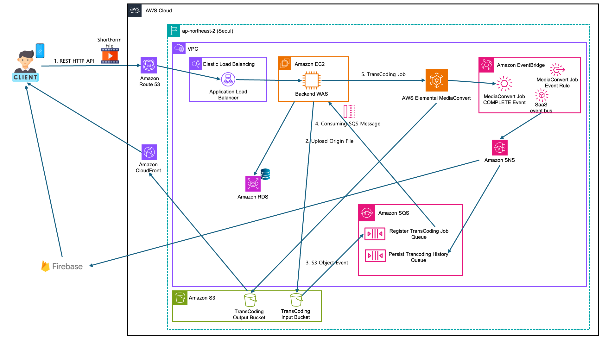

# AWS ShortForm Upload Flow

[TOC]

## 1. Client(App)에서 숏폼 업로드 REST API 호출

- 숏폼 영상 첨부
- AWS Route 53, AWS ALB를 통해 Backend WAS의 API로 라우팅

## 2. 백엔드에서 AWS S3 TransCoding Input Bucket에 원본 파일 업로드

## 3. 백엔드에서 AWS RDS(RDB)에 숏폼, 파일 정보 저장

## 4. 숏폼 업로드 REST API 응답 처리

- Response 예시) 숏폼 업로드가 요청 완료되었습니다. 인코딩까지 잠시만 기다려주세요.

## 5. AWS S3 TransCoding Input Bucket에서 발생한 Objet Event가 AWS SQS로 전송됨

- Register TransCoding Job Queue에 Producing

## 6. 백엔드의 SQS Listener가 Register TransCoding Job Queue의 메시지를 소비

## 7. 백엔드가 AWS Elemental MediaConvert에 TransCoding Job 등록

## 8. AWS Elemental MediaConvert에서 TransCoding 완료

- TransCoding 완료 후 결과물(m3u9, ts, 썸네일.......)은 AWS S3 TransCoding Output Bucket에 저장
- AWS S3 TransCoding Output Bucket의 스트리밍 파일은 CloudFront를 통해 배포

## 9. AWS EventBridge에서 AWS Elemental MediaConvert COMPLETE Event 수신

- AWS EventBridge에 정의된 Rule에 따라 SaaS Event Bus를 통해 AWS SNS 토픽으로 전송

## 10. AWS SNS에서 토픽을 수신하여 Firebase와 AWS SQS TransCoding History Queue에 게시

- Firebase Cloud Messaging을 통해 Client에 인코딩 완료 푸시 알림 전송
- AWS SQS Persist TransCoding History Queue에 트랜스코딩 정보 메시지 전송

## 11. Client(App)에서 FCM 푸시 수신

- 푸시 예시) 숏폼 인코딩이 완료되었습니다. 숏폼 시청이 가능합니다.

## 12. 백엔드의 SQS Listener가 Persist TransCoding History Queue의 메시지를 소비

- 숏폼의 트랜스코딩 이력, CloudFront URL 등을 RDB에 저장
